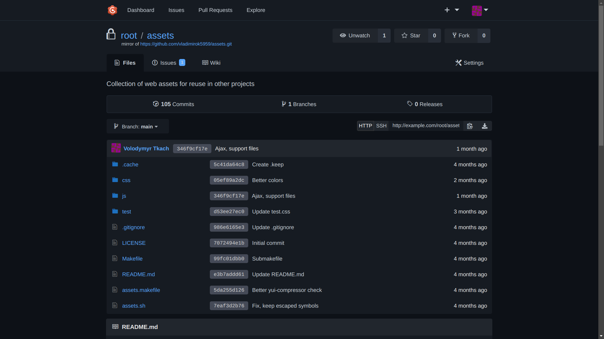
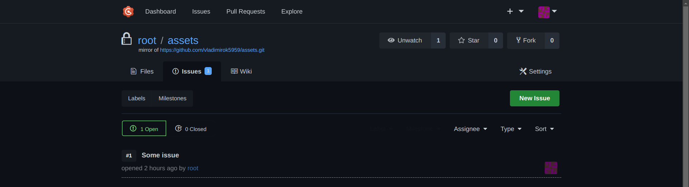
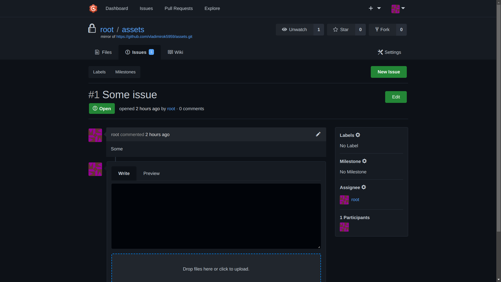

# dark-gogs

Dark theme for Gogs, based on GitHub color scheme

## Screenshots



---



---



## Installation

Simply copy two files `gogs/public/css/dark-gogs.css` and `gogs/templates/inject/head.tmpl` to the Gogs `data` directory with the same paths. `head.tmpl` used only for CSS injection, you can get original file here and include CSS file manually by yourself: [https://github.com/G-Node/gogs/blob/master/templates/inject/head.tmpl](https://github.com/G-Node/gogs/blob/master/templates/inject/head.tmpl)

```txt
data
├── git
├── gogs
├──── conf
├──── data
├──── log
├──── public
├────── css
├──────── dark-gogs.css
├──── templates
├────── inject
├──────── head.tmpl
├── ssh
```

Don't forget to restart Gogs after files placement
